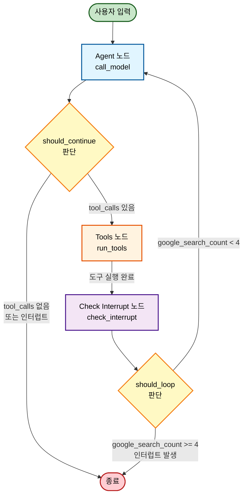

# LangGraph Agent 시스템

생레응 - 사용자의 상황과 기분에 맞춰 요리를 추천하는 에이전트

## 워크플로우 다이어그램



## 주요 구성 요소

### 1. Agent 노드 (call_model)
- LLM에 메시지를 전달하고 응답을 받습니다
- SystemMessage를 자동으로 추가하여 셰프봇 역할 부여
- 도구 스키마를 바인딩하여 함수 호출 가능

### 2. Tools 노드 (run_tools)
- LLM이 요청한 도구를 실행합니다
- 지원 도구:
  - Google Search (검색)
  - Read Memory (사용자 기억 조회)
  - RAG (레시피/지식 검색)
- `google_search_count` 추적

### 3. Check Interrupt 노드 (check_interrupt)
- Google 검색 횟수가 4회 이상이면 경고 메시지 발생
- 사용자의 계속 진행 여부 확인

### 4. 분기 로직
- **should_continue**: tool_calls 여부에 따라 Tools 노드 또는 종료
- **should_loop**: 인터럽트 발생 여부에 따라 Agent 재실행 또는 종료

## 상태 관리

```python
class AgentState(TypedDict):
    messages: List[BaseMessage]  # 대화 기록
    google_search_count: int      # Google 검색 사용 횟수
```

- **MemorySaver**: thread_id별로 상태를 저장하여 대화 컨텍스트 유지

## 사용 방법

### 스트리밍 채팅
```python
agent = make_agent()
for event in agent.chat_stream("파스타 레시피 알려줘", thread_id="user_123"):
    if event["type"] == "ai_message":
        print(event["content"])
    elif event["type"] == "tool_call":
        print(f"🔧 도구 실행: {event['tool_name']}")
```

## 메시지 타입

- **SystemMessage**: 시스템 프롬프트 및 경고 메시지
- **HumanMessage**: 사용자 입력
- **AIMessage**: AI 응답 (tool_calls 포함 가능)
- **ToolMessage**: 도구 실행 결과

## 특징

✅ 대화 기억 유지 (thread_id 기반)  
✅ 도구 사용 횟수 제한 및 경고  
✅ 스트리밍 응답 지원  
✅ RAG 및 Google 검색 통합  
✅ 사용자 취향/알레르기 정보 저장  

## 환경 변수

```bash
OPENAI_API_KEY=your_api_key_here
GOOGLE_API_KEY = "your_api_key_here"
GOOGLE_CSE_ID = "your_api_key_here"
```

Contributors
<table>
  <tr>
    <td align="center">
      <a href="https://github.com/Joo-Nick">
        
        <br />
        <sub><b>서준익</b></sub>
      </a>
      <br />
      <sub>역할: AI 에이전트 설계 및 프론트엔드 개발</sub>
    </td>
    <td align="center">
      <a href="https://github.com/JustinLee02">
        
        <br />
        <sub><b>이수현</b></sub>
      </a>
      <br />
      <sub>역할: AI 에이전트 설계</sub>
    </td>
    <td align="center">
      <a href="https://github.com/Mode1221">
        
        <br />
        <sub><b>정성훈</b></sub>
      </a>
      <br />
      <sub>역할: AI 에이전트 설계 및 데이터 수집</sub>
    </td>
    <td align="center">
      <a href="https://github.com/suleunky">
        
        <br />
        <sub><b>조은기</b></sub>
      </a>
      <br />
      <sub>역할: AI 에이전트 설계</sub>
    </td>
  </tr>
</table>