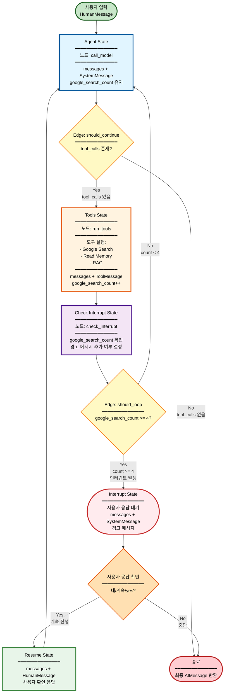

# LangGraph Agent 시스템

생레응 - 사용자의 상황과 기분에 맞춰 요리를 추천하는 에이전트

## 워크플로우 다이어그램


```mermaid
graph TD
    Start([사용자 입력<br/>HumanMessage]) --> Agent
    
    Agent[Agent State<br/>━━━━━━━━━━━━━━━<br/>노드: call_model<br/>━━━━━━━━━━━━━━━<br/>messages + SystemMessage<br/>google_search_count 유지]
    
    Agent --> Decision1{Edge: should_continue<br/>━━━━━━━━━━━━━━━<br/>tool_calls 존재?}
    
    Decision1 -->|Yes<br/>tool_calls 있음| Tools
    Decision1 -->|No<br/>tool_calls 없음| End([종료<br/>━━━━━━━━━━━━━━━<br/>최종 AIMessage 반환])
    
    Tools[Tools State<br/>━━━━━━━━━━━━━━━<br/>노드: run_tools<br/>━━━━━━━━━━━━━━━<br/>도구 실행:<br/>- Google Search<br/>- Read Memory<br/>- RAG<br/>━━━━━━━━━━━━━━━<br/>messages + ToolMessage<br/>google_search_count++]
    
    Tools --> CheckInt
    
    CheckInt[Check Interrupt State<br/>━━━━━━━━━━━━━━━<br/>노드: check_interrupt<br/>━━━━━━━━━━━━━━━<br/>google_search_count 확인<br/>경고 메시지 추가 여부 결정]
    
    CheckInt --> Decision2{Edge: should_loop<br/>━━━━━━━━━━━━━━━<br/>google_search_count >= 4?}
    
    Decision2 -->|No<br/>count < 4| Agent
    Decision2 -->|Yes<br/>count >= 4<br/>인터럽트 발생| Interrupt([Interrupt State<br/>━━━━━━━━━━━━━━━<br/>사용자 응답 대기<br/>messages + SystemMessage<br/>경고 메시지])
    
    Interrupt --> WaitUser{사용자 응답 확인<br/>━━━━━━━━━━━━━━━<br/>네/계속/yes?}
    
    WaitUser -->|Yes<br/>계속 진행| Resume[Resume State<br/>━━━━━━━━━━━━━━━<br/>messages + HumanMessage<br/>사용자 확인 응답]
    WaitUser -->|No<br/>중단| End
    
    Resume --> Agent
    
    style Agent fill:#e1f5ff,stroke:#01579b,stroke-width:3px,color:#000
    style Tools fill:#fff3e0,stroke:#e65100,stroke-width:3px,color:#000
    style CheckInt fill:#f3e5f5,stroke:#4a148c,stroke-width:3px,color:#000
    style Decision1 fill:#fff9c4,stroke:#f57f17,stroke-width:2px,color:#000
    style Decision2 fill:#fff9c4,stroke:#f57f17,stroke-width:2px,color:#000
    style Interrupt fill:#ffebee,stroke:#c62828,stroke-width:3px,color:#000
    style WaitUser fill:#ffe0b2,stroke:#e65100,stroke-width:2px,color:#000
    style Resume fill:#e8f5e9,stroke:#2e7d32,stroke-width:3px,color:#000
    style Start fill:#c8e6c9,stroke:#1b5e20,stroke-width:3px,color:#000
    style End fill:#ffcdd2,stroke:#b71c1c,stroke-width:3px,color:#000
```

## 주요 구성 요소

### 1. Agent State (call_model 노드)
- **입력**: messages (이전 대화 기록)
- **처리**: 
  - SystemMessage 자동 추가 (셰프봇 역할 부여)
  - LLM에 메시지 전달 및 응답 수신
  - 도구 스키마 바인딩
- **출력**: AIMessage (tool_calls 포함 가능)
- **상태 변화**: messages에 AIMessage 추가

### 2. Tools State (run_tools 노드)
- **입력**: AIMessage with tool_calls
- **처리**: 
  - 요청된 도구 실행
    - Google Search (검색)
    - Read Memory (사용자 기억 조회)
    - RAG (레시피/지식 검색)
  - google_search_count 카운트 증가
- **출력**: ToolMessage
- **상태 변화**: 
  - messages에 ToolMessage 추가
  - google_search_count 증가

### 3. Check Interrupt State (check_interrupt 노드)
- **입력**: 현재 상태 (google_search_count 포함)
- **처리**: 
  - google_search_count >= 4 확인
  - 조건 충족 시 경고 SystemMessage 추가
- **출력**: 상태 (경고 메시지 포함 가능)
- **상태 변화**: 
  - 필요 시 messages에 경고 SystemMessage 추가

### 4. Interrupt State (인터럽트 발생)
- **입력**: 경고 메시지가 포함된 상태
- **처리**: 사용자 응답 대기 (그래프 실행 일시 중지)
- **출력**: 사용자 HumanMessage
- **상태 변화**: messages에 사용자 응답 추가

### 5. Resume State (재개)
- **입력**: 사용자의 확인 응답
- **처리**: 워크플로우 재개
- **출력**: 다시 Agent State로 전환

## Edge (분기) 로직

### should_continue (Agent → Tools or End)
```python
if state["messages"][-1].tool_calls:
    return "tools"  # Tools State로 이동
else:
    return END  # 종료
```

### should_loop (CheckInt → Agent or Interrupt)
```python
if state["google_search_count"] < 4:
    return "agent"  # Agent State로 루프백
else:
    # 인터럽트 발생
    # 사용자가 "네/계속/yes" → agent
    # 사용자가 다른 답변 → END
```

## 상태 관리

```python
class AgentState(TypedDict):
    messages: List[BaseMessage]  # 대화 기록
    google_search_count: int      # Google 검색 사용 횟수
```

### State 변화 추적

| 단계 | State 내용 | 비고 |
|------|-----------|------|
| Start | `messages: [HumanMessage]`<br/>`google_search_count: 0` | 초기 상태 |
| Agent | `messages: [..., SystemMessage, AIMessage]` | SystemMessage 자동 추가 |
| Tools | `messages: [..., ToolMessage]`<br/>`google_search_count: 1` | 도구 실행 결과 추가 |
| Check Interrupt | `messages: [..., SystemMessage(경고)]` | 4회 이상 시 경고 추가 |
| Interrupt | 그래프 일시 중지 | 사용자 응답 대기 |
| Resume | `messages: [..., HumanMessage(확인)]` | 사용자 응답 추가 |

- **MemorySaver**: thread_id별로 상태를 저장하여 대화 컨텍스트 유지

## 사용 방법

### 스트리밍 채팅
```python
agent = make_agent()
for event in agent.chat_stream("파스타 레시피 알려줘", thread_id="user_123"):
    if event["type"] == "ai_message":
        print(event["content"])
    elif event["type"] == "tool_call":
        print(f"🔧 도구 실행: {event['tool_name']}")
```

## 메시지 타입

- **SystemMessage**: 시스템 프롬프트 및 경고 메시지
- **HumanMessage**: 사용자 입력
- **AIMessage**: AI 응답 (tool_calls 포함 가능)
- **ToolMessage**: 도구 실행 결과

## 특징

✅ 대화 기억 유지 (thread_id 기반)  
✅ 도구 사용 횟수 제한 및 경고  
✅ 스트리밍 응답 지원  
✅ RAG 및 Google 검색 통합  
✅ 사용자 취향/알레르기 정보 저장  
✅ 명확한 State 관리 및 추적  

## 환경 변수

```bash
OPENAI_API_KEY=your_api_key_here
GOOGLE_API_KEY=your_api_key_here
GOOGLE_CSE_ID=your_api_key_here
```

## Contributors
<table>
  <tr>
    <td align="center">
      <a href="https://github.com/Joo-Nick">
        
        <br />
        <sub><b>서준익</b></sub>
      </a>
      <br />
      <sub>역할: AI 에이전트 설계 및 프론트엔드 개발</sub>
    </td>
    <td align="center">
      <a href="https://github.com/JustinLee02">
        
        <br />
        <sub><b>이수현</b></sub>
      </a>
      <br />
      <sub>역할: AI 에이전트 설계</sub>
    </td>
    <td align="center">
      <a href="https://github.com/Mode1221">
        
        <br />
        <sub><b>정성훈</b></sub>
      </a>
      <br />
      <sub>역할: AI 에이전트 설계 및 데이터 수집</sub>
    </td>
    <td align="center">
      <a href="https://github.com/suleunky">
        
        <br />
        <sub><b>조은기</b></sub>
      </a>
      <br />
      <sub>역할: AI 에이전트 설계</sub>
    </td>
  </tr>
</table>